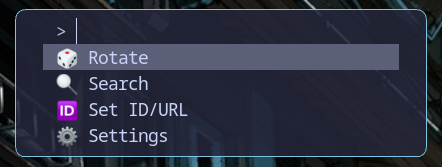
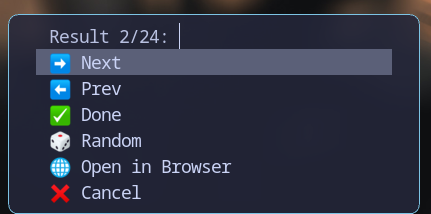
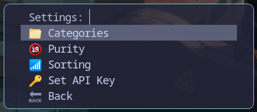

# HyprWallhaven

> **Note:** This app is 99% vibe coded, and was built for my own needs. No warranties or support is provided. You are encouraged to take this idea and spin it off in a proper way. Contributions are welcome.

A Rust-based CLI tool for managing wallpapers from Wallhaven on Hyprland (Wayland). It integrates with `fuzzel` for an interactive menu system and uses `hyprpaper` for setting wallpapers.

## Features

- **Interactive Menu**: Browse and select wallpapers using `fuzzel`.
- **Collections**: Browse and cycle through your personal Wallhaven collections (requires API key).
- **Search**: Search Wallhaven with support for queries, categories, purity, and sorting.
- **Rotate**: Quickly set a random wallpaper from the "Hot" list.
- **Specific Set**: Set wallpapers by Wallhaven ID or direct URL.
- **Auto-Orientation**: Automatically detects monitor aspect ratio (landscape/portrait) and rotation to request appropriate wallpapers.
- **Workspace Integration**: Temporarily switches to an empty workspace during selection for unobstructed preview.
- **Authentication**: Supports Wallhaven API keys for accessing NSFW/restricted content.
- **Persistence**: Remembers settings (Categories, Purity, Sorting) across sessions.
- **Hyprlock Support**: Automatically generates a compatible `hyprlock` configuration.
- **Session Restoration**: Restore your last set wallpapers automatically on reboot.

## Screenshots


*Interactive demo*


*Main interactive menu*


*Browsing search results*


*Settings configuration*

## Installation

### AUR (Arch User Repository)

You can install `hyprwallhaven` directly from the AUR using your preferred helper:

```bash
yay -S hyprwallhaven-bin
# or
paru -S hyprwallhaven-bin
```

### Build from Source

1.  Clone the repository:
    ```bash
    git clone https://github.com/AnatolyRugalev/hyprwallhaven.git
    cd hyprwallhaven
    ```

2.  Install using Cargo:
    ```bash
    cargo install --path .
    ```
    This installs the binary to `~/.cargo/bin/hyprwallhaven`. Ensure this directory is in your `$PATH`.

3.  Install the Desktop Entry (Optional but recommended for launcher integration):
    ```bash
    mkdir -p ~/.local/share/applications
    cp hyprwallhaven.desktop ~/.local/share/applications/
    ```

## Setup & Configuration

### 1. Restore on Boot (Systemd)

The recommended way to restore wallpapers is using the provided systemd user service. This ensures proper ordering after `hyprpaper`.

```bash
systemctl --user enable --now hyprwallhaven.service
```

### 2. Manual Restore (Alternative)

If you prefer not to use systemd or are running from source without installing the unit file, you can add this to your `~/.config/hypr/hyprland.conf`:

```ini
exec-once = hyprwallhaven restore
```

> **Important:** This feature relies on `hyprpaper` and `systemd` user services. It is strictly recommended to run Hyprland using **UWSM** (Universal Wayland Session Manager) to ensure proper environment and service startup.

### 3. Hyprlock Integration

HyprWallhaven automatically maintains a separate configuration file for `hyprlock` that ensures your lock screen background matches your desktop wallpaper.

To enable this, add the following line to your `~/.config/hypr/hyprlock.conf`:

```ini
source = ~/.config/hypr/hyprwallhaven-hyprlock.conf
```

### 4. General Configuration

The main configuration file is located at `~/.config/hypr/hyprwallhaven.toml`. It is generated automatically on the first run.

> **Note:** I am aware that code-generated configuration files pose usability problems (i.e. comments are lost, user-specified settings are overwritten), but this tool's main feature is to provide interactive UX, so I don't really care enough to implement lossless config updates.

#### Defaults

```toml
# Command to set the wallpaper.
# %f is replaced by the image path.
# %m is replaced by the monitor name (auto-detected).
wallpaper_cmd = "hyprctl hyprpaper preload %f; hyprctl hyprpaper wallpaper \"%m,%f\""

# Directory for downloaded wallpapers.
save_dir = "~/Pictures/Wallpapers/Wallhaven"

# Optional: API Key for NSFW/restricted content.
# api_key = "YOUR_API_KEY"

# Search Defaults (can be changed in Settings menu)
categories = "111" # General/Anime/People
purity = "100"     # SFW/Sketchy/NSFW
sorting = "hot"
```

### API Key

To access NSFW or restricted content, an API key is required:

1.  Get your API key from your [Wallhaven Account Settings](https://wallhaven.cc/settings/account).
2.  Uncomment and set `api_key` in `~/.config/hypr/hyprwallhaven.toml`.

> **Note:** An API Key is **required** to use the Collections feature.

## Usage

### CLI

- **Open Menu**: `hyprwallhaven menu`
- **Rotate (Random Hot)**: `hyprwallhaven rotate`
- **Set by ID/URL**: `hyprwallhaven set <ID_OR_URL>`
- **Search (Browser)**: `hyprwallhaven search <QUERY>`
- **Restore**: `hyprwallhaven restore` (usually run automatically)

### Interactive Controls

When browsing wallpapers:
- **Next/Prev**: Cycle through search results.
- **Random**: Pick a random result from the current batch.
- **Open in Browser**: Open the current image or search context in the default web browser.
- **Done**: Keep the current wallpaper and exit.
- **Cancel**: Revert to the original wallpaper and return/exit.

## License

[MIT License](LICENSE)
